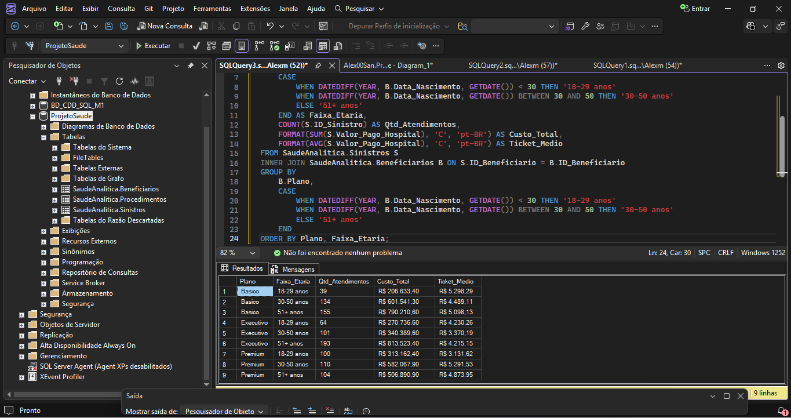
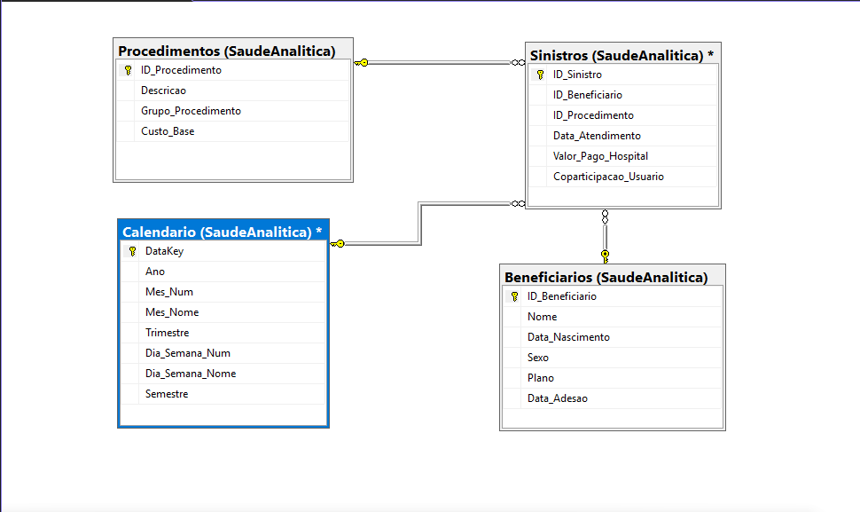
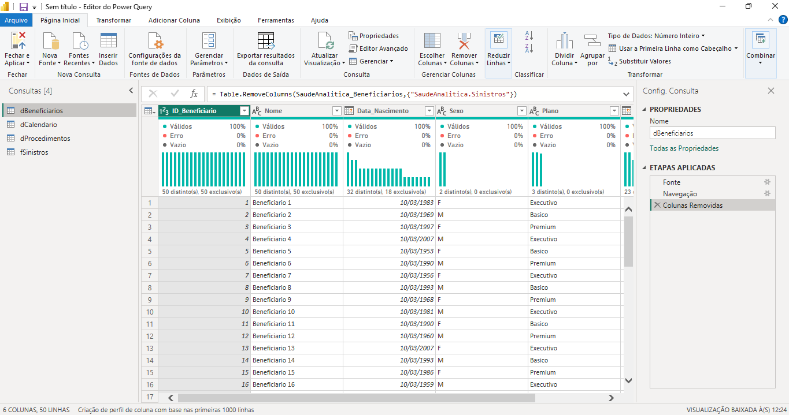
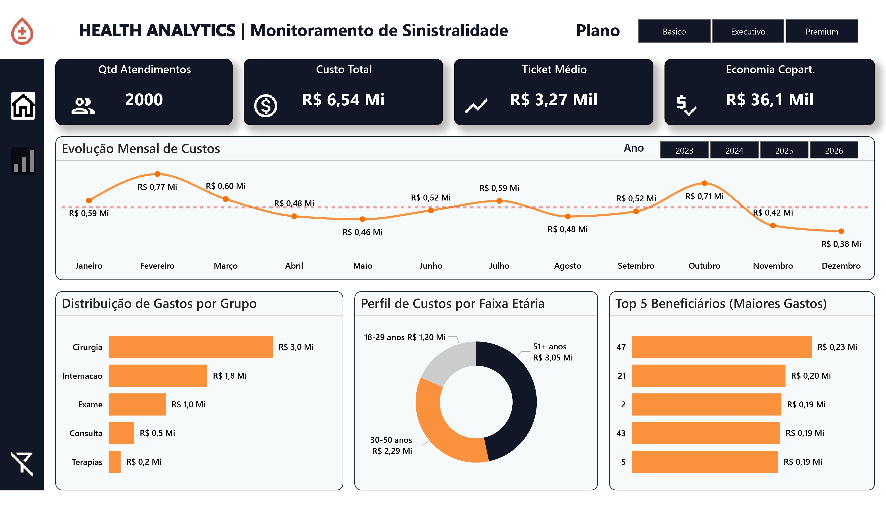
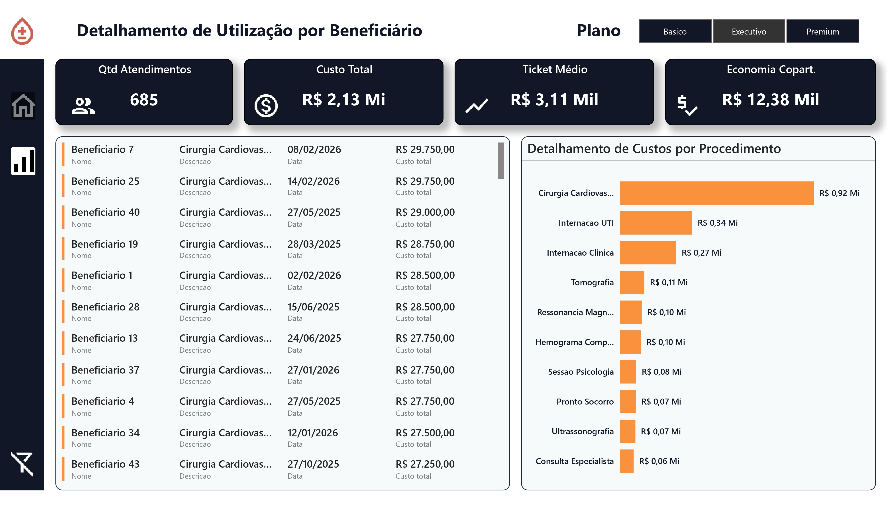

# 🩺 Health Analytics: Monitoramento de Sinistralidade

Este projeto apresenta uma solução completa de Business Intelligence para o setor de saúde suplementar, focando no controle de sinistralidade e auditoria de custos assistenciais.

---

## 🛠️ Camadas Técnicas do Projeto

### 1. Inteligência de Dados (SQL Server)
Extração e tratamento de dados brutos utilizando queries complexas para criação de faixas etárias e agrupamentos financeiros.

### 2. Arquitetura e Modelagem (Star Schema)
Implementação de modelagem multidimensional para garantir performance analítica e integridade referencial.

### 3. Tratamento e ETL (Power Query)
Limpeza, padronização e tipagem de dados através do Power Query.

### 4. Visualização e UX Design (Power BI)
Interface moderna com navegação lateral e detalhamento granular de procedimentos.

---

## 🔧 Ferramentas Utilizadas
- **SQL Server** | **Power BI** | **Power Query**
